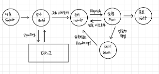

# 응용 SW 기초 기술 활용

## 운영체제

- 컴퓨터 시스템의 자원들을 효율적으로 관리하며 컴퓨터를 효과적으로 사용할 수 있는 환경을 제공하는 여러 프로그램의 모임

### UNIX

- 벨 연구소, MIT, General Electric이 공동 개발한 운영체제
- 시분할 시스템을 위해 설계된 대화식 운영체제

#### UNIX 시스템의 구성

- 커널: 프로그램과 하드웨어 간의 인터페이스로, 하드웨어를 보호
  - 프로세스 관리, 기억장치 관리, 파일 관리, 입출력 관리, 프로세스간 통신, 데이터 전송 및 변환 등 여러 기능을 수행
- 쉘: 시스템과 사용자 간의 인터페이스로, 사용자의 명령어를 인식하여 프로그램을 호출하고 명령을 수행

## 기억장치 관리

### 반입 전략

- 보조기억장치에 저장 중인 프로그램이나 데이터를 언제 주기억장치로 적재할 것인지를 결정하는 전략

#### 요구 반입

- 실행 중인 프로그램이 특정 프로그램이나 데이터 등의 참조를 요구할 때 적재하는 방법

#### 예상 반입

- 실행 중인 프로그램에 의해 참조될 프로그램이나 데이터를 미리 예상하여 적재하는 방법

### 배치 전략

- 프로그램이나 데이터를 주기억장치의 어디에 위치시킬 것인지를 결정하는 전략
- 단편화: 영역을 분할하고 나서 생각는 빈 기억 공간

#### 최초 적합(First Fit)

- 데이터가 들어갈 수 있는 영역 중 첫 번째 분할 영역에 배치

#### 최적 적합(Best Fit)

- 빈 영역 중 단편화를 가장 작게 남기는 영역에 배치

#### 최악 적합(Worst Fit)

- 빈 영역 중 단편화를 가장 크게 남기는 영역에 배치

## 페이지 교체 알고리즘

- 페이지 부재(Fault)가 발생했을 때 주 기억 장치의 모든 페이지 프레임이 사용중이라면 어떤 페이지 프레임을 선택하여 교체할 것인지를 결정하는 기법

### OPT

OPTimal replacement: 앞으로 가장 오랫동안 사용하지 않을 페이지를 교체하는, 이상적이지만 불가능한 알고리즘

### FIFO

First-In First-Out: 가장 먼저 들어온, 가장 오래된 페이지를 교체하는 기법

### LRU

Least Recently Used: 최근에 가장 오랫동안 사용하지 않은 페이지를 교체하는 기법

### LFU

Least Frequently Used: 사용 빈도가 가장 적은 페이지를 교체하는 기법

### NUR

Not Used Recently: 최근에 사용하지 않은 페이지를 교체

## 가상기억장치 기타 관리 사항

### Locality

Locality(국부성, 지역성, 구역성, 국소성): 프로세스가 실행되는 동안 주기억장치를 참조할 때 일부 페이지만 집중적으로 참조하는 성질

- 시간 구역성(Temporal Locality): 프로세스가 실행되면서 하나의 페이지를 일정 시간 동안 집중적으로 액세스하는 현상
- 공간 구역성(Spatial Locality): 프로세스 실행 시 일정 위치의 페이지를 집중적으로 액세스하는 현상

## 프로세스

- 실행중인 프로그램을 의미

### PCB

Process Control Block: 운영체제가 프로세스에 대한 중요 정보를 저장하는 곳

- 저장 정보: 프로세스의 상태, 포인터, 프로세스 고유 식별자, 스케쥴링 우선순위, CPU 레지스터 정보, 주기억장치 관리 정보, 입출력 상태 정보, 계정 정보

### 프로세스 상태 전이

| 상태                       | 내용 설명                                                                                    |
| -------------------------- | -------------------------------------------------------------------------------------------- |
| 제출 (Submit)              | 사용자가 작업(Job)을 시스템에 제출한 상태                                                    |
| 접수 (Hold)                | 작업이 시스템에 의해 받아들여졌지만, 아직 메모리에 적재되지 않은 대기 상태 (디스크에 저장됨) |
| 준비 (Ready)               | 메모리에 적재되어 CPU 할당을 기다리는 상태                                                   |
| 실행 (Run)                 | CPU를 할당받아 실제로 명령어를 수행 중인 상태                                                |
| 대기 / 블록 (Wait / Block) | I/O 요청 등으로 인해 당장 실행할 수 없고, 외부 자원을 기다리는 상태                          |
| 종료 (Exit)                | 실행이 완료되어 시스템 자원을 반납하고 종료된 상태                                           |

## 스케쥴링

- 시스템의 여러 자원을 해당 프로세스에 할당하는 작업

### 주요 스케쥴링 알고리즘

#### FCFS

First Come First Service(FIFO): 준비상태 큐에 도착한 순서에 따라 차례로 CPU에 할당하는 기법

#### SJF

Shortest Job First: 준비상태 큐에서 실행 시간이 가장 짧은 프로세스에게 먼저 CPU를 할당하는 기법

#### HRN

Highest Response-ratio Next: 우선순위를 계산하여 그 숫자가 가장 높은 것부터 낮은 순으로 우선순위를 부여

- 우선순위: (대기 시간 + 서비스 시간) / 서비스 시간

#### RR

Round Robin: 시간 할당량 동안 프로세스를 실행 후 다음 프로세스에게 CPU를 넘겨주는 방식식

#### SRT

Shortest Remaining Time: 현재 실행중인 프로세스의 남은 시간과 새로 도착한 프로세스의 실행 시간을 비교해 가장 짧은 실행 시간을 요구하는 프로세스에게 CPU를 할당

## 운영체제 기본 명령어

### Windows

- `DIR`: 현재 디렉터리의 파일 목록 표시
- `COPY 파일 디렉토리`: 파일 복사
- `DEL 파일`: 파일 삭제
- `TYPE 파일`: 파일의 내용 표시
- `REN 파일 새_파일명`: 파일 이름 변경
- `MD 디렉토리명`: 디렉토리 생성
- `CD 디렉토리`: 디렉토리의 위치를 변경
- `CLS`: 화면의 내용을 지움
- `ATTRIB 속성 파일`: 파일의 속성(`R`: 읽기 전용, `A`: 저장/백업, `S`: 시스템 파일, `H`: 숨김) 변경
- `FIND 문자열 파일`: 파일에서 문자열을 찾음
- `CHKDSK`: 현재 디스크 상태 점검
- `FORMAT 드라이브명`: 디스크 표면을 트랙과 섹터로 나누어 초기화
- `MOVE 파일 디렉토리`: 파일 이동

### UNIX/LINUX 기본 명령어

- `cat 파일명`: 파일 내용을 화면에 표기
- `cd 디렉토리`: 디렉토리의 위치를 변경
- `chmod 유저=권한(rwx) 파일명`: 파일의 보호 모드를 설정하여 파일의 사용 허가를 지정
- `chown 사용자 파일명`: 파일 소유자와 그룹을 변경
- `cp 파일명 디렉토리`: 파일을 복사
- `rm 파일명`: 파일 삭제
- `find 파일명`: 파일을 찾음
- `fsck 디렉토리`: 디렉토리 안의 모든 파일 시스템을 검사하고 보수
- `kill PID`: 프로세스 종료
- `fork()`: 새로운 프로세스 생성
- `killall 프로세스명`: 프로세스의 이름을 활용해 프로세스 종료
- `ls`: 현재 디렉토리의 파일 목록 표시
- `mkdir 디렉토리명`: 디렉토리 생성
- `rmdir 디렉토리명`: 디렉토리 삭제
- `mv 파일명 디렉토리`: 파일 이동
- `ps`: 현재 실행중인 프로세스를 표시
- `pwd`: 현재 작업중인 디렉토리 경로 표시
- `top`: 시스템의 프로세스와 메모리 사용 현황을 표시
- `who`: 현재 시스템에 접속해 있는 사용자를 표시

## 인터넷

- TCP/IP 프로토콜을 기반으로 전 세계 수많은 컴퓨터들과 네트워크들이 연결된 광범위한 컴퓨터 통신망

### IP 주소

- 인터넷에 연결된 모든 컴퓨터 자원을 구분하기 위한 고유한 주소
  - A 클래스: 국가나 대형 통신망에 사용되는 8~32자리의 2^24짜리 주소
  - B 클래스: 중대형 통신망에 사용되는 16~32자리의 2^16짜리 주소
  - C 클래스: 소규모 통신망에 사용되는 25~32자리의 2^8짜리 주소

### 서브네팅

- 네트워크 주소를 다시 여러 개의 작은 네트워크로 나누어 사용하는 것
- IP 주소 중 네트워크 주소와 호스트 주소를 구분하기 위한 비트가 서브넷 마스크이고, 이를 변경해 네트워크 주소를 여러 개로 분할하여 사용

### IPv6

- 128비트로 주소의 길이가 늘어나 주소 부족 무제를 해결하고, 인증성 / 기밀성 / 데이터 무결성을 지원
- 유니캐스트(1:1 통신), 멀티캐스트(1:N 통신), 애니캐스트(가장 가까운 수신자와 1:1 통신)

## OSI 참조 모델

- Open System Interconnection 참조 모델: ISO에서 원활한 통신을 위해 제안한 통신 규약

### 물리 계층

- 전송에 필요한 두 장치 간 실제 접속과 절단 등 기계적, 전기적, 기능적, 절차적 특성에 대한 규칙을 정의
- RS-232C, X.21 등의 표준이 있음
- 리피터, 허브가 사용됨

### 데이터 링크 계층

- 두 개의 개방 시스템 간 신뢰성있는 정보 전송을 위해 시스템 간 연결 설정과 유지 및 종료를 담당
- 송수신 간 속도 차이 해결을 위한 흐름 제어
- 프레임의 시작과 끝을 구분하기 위한 프레임 동기화
- 오류 제어, 순서 제어
- HDLC, LAPB, LLC, MAC, LAPD, PPP 등의 표준을 가짐
- 랜카드, 브리지, 스위치가 사용됨

### 네트워크 계층

- 개방 시스템 간 네트워크 연결 관리 및 데이터의 교환 및 중계 기능을 담당
- 네트워크 연결의 설정/유지/해제, 경로 설정(라우팅), 트래픽 제어, 패킷 정보 전송을 수행
- X.25, IP 등의 표준을 가짐
- 라우터가 사용됨

### 전송 계층

- 인터페이스를 담당하는, 논리적 안정과 균일한 데이터 전송 서비스를 제공하여 투명한 End-to-End 전송을 가능케 함
- 주소 설정, 다중화, 오류 제어, 흐름 제어 수행
- TCP, UDP 등의 표준이 있음
- 게이트웨이가 사용됨

### 세션 계층

- 송/수신 측 간 관련성을 유지하고 대화 제어를 담당
- 대화 생성, 관리, 종료를 토큰으로 제어하고 데이터 교환을 관리함

### 표현 계층

- 코드 변환, 데이터 암호화, 데이터 압축, 구문 검색, 정보 형식 변환, 문맥 관리

### 응용 계층

- 응용 프로그램와 사용자를 연결하는 서비스를 제공

## TCP/IP

### 프로토콜

- 데이터 교환을 원활히 수행할 수 있도록 표준화시켜 놓은 통신 규약

### TCP/IP

Transmission Control Protocol/Internet Protocol: 서로 다른 기종의 컴퓨터들이 데이터를 주고 받을 수 있도록 하는 표준 프로토콜

- TCP: 전송(4)계층에 해당하여 가상 회선 방식을 기반으로 연결형 서비스 제공
  - 패킷(세그먼트)의 다중화, 순서 제어, 오류 제어, 흐름 제어 기능 제공
- IP: 네트워크(3)계층에 해당하여 데이터그램 방식으로 비연결형 서비스를 제공
  - 패킷의 분해 / 조립, 주소 지정, 경로 선택 기능 제공

### TCP/IP 구조

- 응용 계층(OSI 5~7계층): 응용 프로그램 간 데이터 송/수신 제공
  - TELNET, FTP, SMTP, SNMP, DNS, HTTP
- 전송 계층(OSI 4계층): 호스트 간 신뢰성 있는 통신 제공
  - TCP, UDP, RTCP
- 인터넷 계층(OSI 3계층): 데이터 전송을 위한 주소 지정, 경로 설정 제공
  - IP, ICMP, IGMP, ARP, RARP
- 네트워크 액세스 계층(OSI 1~2계층): 실제 데이터(프레임)를 송/수신
  - Eternet, IEEE 802, HDLC, X.25, RS-232C, ARQ 등

### 응용 계층의 주요 프로토콜

- FTP(File Transfer Protocol): 컴퓨터와 컴퓨터 / 인터넷 사이에서 파일을 주고 받을 수 있도록 하는 원격 파일 전송 프로토콜
- SMTP(Simple Mail Transfer Protocol): 메일 교환 서비스
- TELNET: 멀리 떨어진 다른 컴퓨터에 접속하여 가상의 터미널 기능을 통해 시스템 관리 작업을 할 수 있는 서비스
- SNMP(Simple Network Management Protocol): 라우터/허브 등 네트워크 기기의 네트워크 정보를 네트워크 관리 시스템(응용 서비스)에 보내는 데 사용되는 표준 통신 규약
- DNS(Domain Name System): 도메인 네임을 IP 주소로 매핑하는 시스템
- HTTP(HyperText Trasfer Protocol): WWW에서 HTML(모든 객체)를 송수신하기 위한 표준 프로토콜

### 전송 계층의 주요 프로토콜

- TCP(Transmission Control Protocol): 가상 회선 연결을 통해 양방향 서비스를 제공
  - 스트림 위주의 전달
  - 순서 제어, 오류 제어, 흐름 제어를 통해 오류 발생 시 투명성을 보장
- UDP(User Datagram Protocol): 데이터 전송 전 연결을 설정하지 않는 비연결형 서비스 제공
  - 단순한 헤더 구조로 전송 속도가 빠르고 오버헤드가 적음
  - 신뢰성보다는 속도가 중요시 되는 네트워크에 사용
  - 헤더에 Source Port Number, Destination Port Number, Length, Checksum(데이터 전송 오류 확인용) 등 포함
- RTCP(Real-Time Control Protocol): RTP 패킷의 전송 품질을 제어하기 위한 제어 프로토콜
  - 세션 참가자들에게 제어 정보를 주기적으로 전송하고, 제어 패킷의 다중화를 제공
  - 데이터 전송을 모니터링하고 최소한의 제어와 인증 기능만을 제공

### 인터넷 계층의 주요 프로토콜

- IP(Internet Protocol): 전송할 데이터에 주소를 지정하고 경로를 설정
  - 데이터그램 방식을 사용하여 신뢰성이 보장되지 않음
- ICMP(Internet Control Message Protocol): IP와 조합하여 통신 중 발생하는 오류 처리와 전송 경로 변경 등을 위한 제어 메시지를 관리
  - 8바이트의 헤더로 구성
- IGMP(Internet Group Management Protocol): 멀티캐스트를 지원하는 호스트 / 라우터에서 멀티캐스트 그룹 유지를 위해 사용
- ARP(Address Resolution Protocol): 호스트의 IP 주소를 연결된 네트워크 장치의 MAC 주소로 변경
- RARP(Reverse ARP): 물리적 주소(MAC 주소)를 IP 주소로 변환

### 네트워크 액세스 계층의 주요 프로토콜
- Ethernet: CSMA/CD 방식의 LAN
- HDLC: 비트 위주의 데이터 링크 제어 프로토콜
- X.25: 패킷 교환망을 통한 DTE와 DCE 간 인터페이스를 제공하는 프로토콜
- RS-232C: 공중 전화 교환망(PSTN)을 통해 DTE와 DCE 간 인터페이스를 제공하는 프로토콜